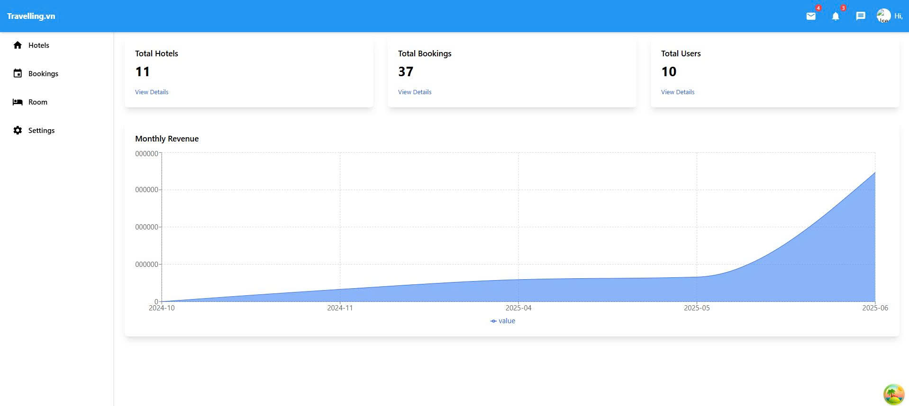
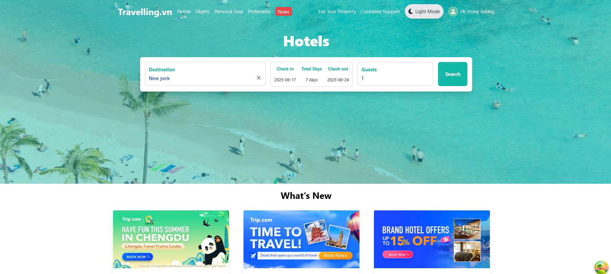
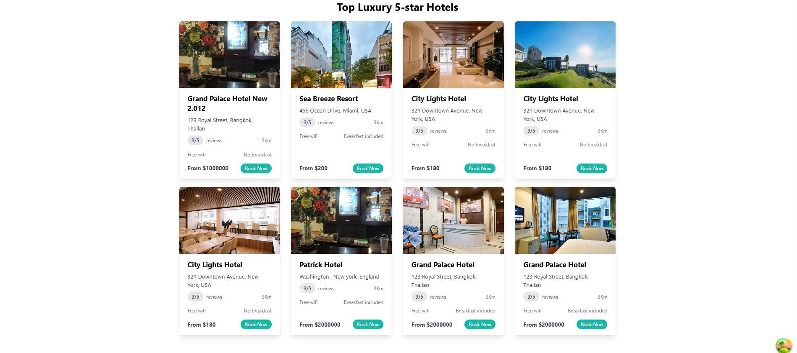
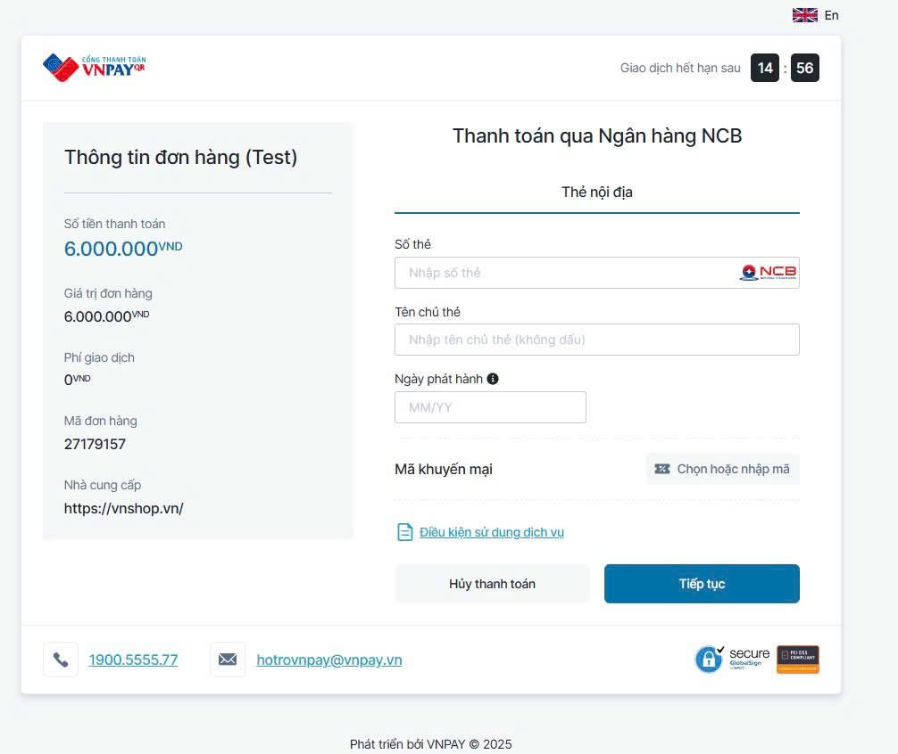

# Hotel Booking Frontend

This is the **Frontend** project for a hotel booking website.

---

## 📅 Timeline & Progress

### 14/04 - 20/04/2025

- Developed the **Login** and **Register** pages' UI.
- Initial setup for user authentication interface.

---

### 21/04 - 27/04/2025

- Developed the **Admin Dashboard** UI.
- Integrated **API calls** for:
  - User login
  - User registration
  - Google authentication

---

### 28/04 - 04/05/2025

- Designed the **Home Page** UI.
  

- Created the **Hotel List** page showing available hotels.
  
- Implemented the **Hotel Filter/Search** page.
  

---

### 05/05 - 11/05/2025

- Designed the **Home Detail Page** UI.
  
- Designed the **Booking Page** UI.
  
  Work:
  Use useQuery to fetch hotel information and useMutation to implement the booking functionality.

### 12/05 - 18/05/2025

- Implemented VNPAY Payment Integration on the frontend.
  
  Work:
  Integrated VNPAY API for handling payment processing. After booking, users are redirected to VNPAY and returned with payment status.
  

### 19/05 - 25/05/2025

Developed the Comment Section for hotel detail pages.

Built the Related Hotels feature to suggest hotels based on category.

Added User Profile Management functionality, allowing users to view and update their personal information.

### 26/05 - 01/06/2025

List Hotel Admin Page

Create Hotel Admin Page

Edit Hotel Admin Page

### 02/06 - 08/06/2025

List Room Admin Page

Create Room Admin Page

Edit Room Admin Page

### 09/06 - 15/06/2025

List Bookings Admin Page

Booking Detail Page

Dashboard

## 🚀 Technologies Used

- React.js
- TypeScript
- Tailwind CSS
- useQuery (for API calls)

---

## 📂 Project Structure
