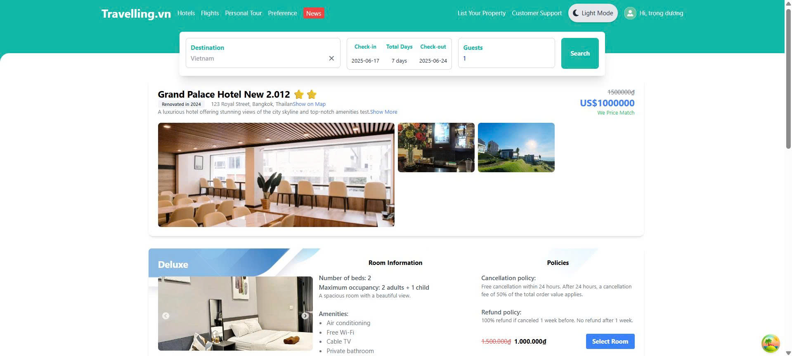
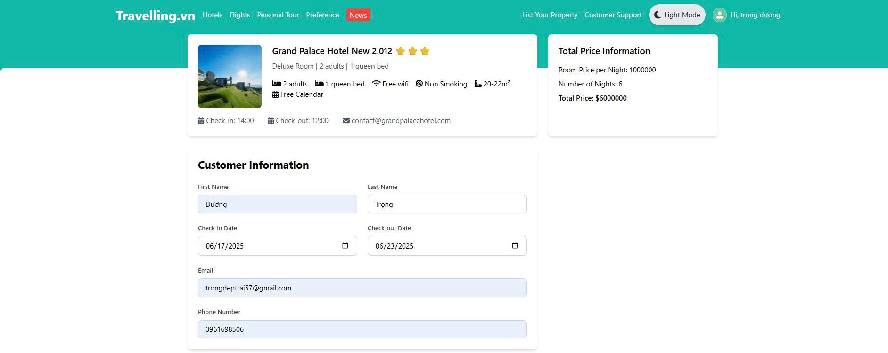

# Hotel Booking Frontend

This is the **Frontend** project for a hotel booking website.

---

## 📅 Timeline & Progress

### 14/04 - 20/04/2025

- Developed the **Login** and **Register** pages' UI.
- Initial setup for user authentication interface.

---

### 21/04 - 27/04/2025

- Developed the **Admin Dashboard** UI.
- Integrated **API calls** for:
  - User login
  - User registration
  - Google authentication

---

### 28/04 - 04/05/2025

- Designed the **Home Page** UI.
  

- Created the **Hotel List** page showing available hotels.
  
- Implemented the **Hotel Filter/Search** page.
  

---

### 05/05 - 11/05/2025

- Designed the **Home Detail Page** UI.
  
- Designed the **Booking Page** UI.
  
  Work:
  Use useQuery to fetch hotel information and useMutation to implement the booking functionality.

## 🚀 Technologies Used

- React.js
- TypeScript
- Tailwind CSS
- useQuery (for API calls)

---

## 📂 Project Structure
